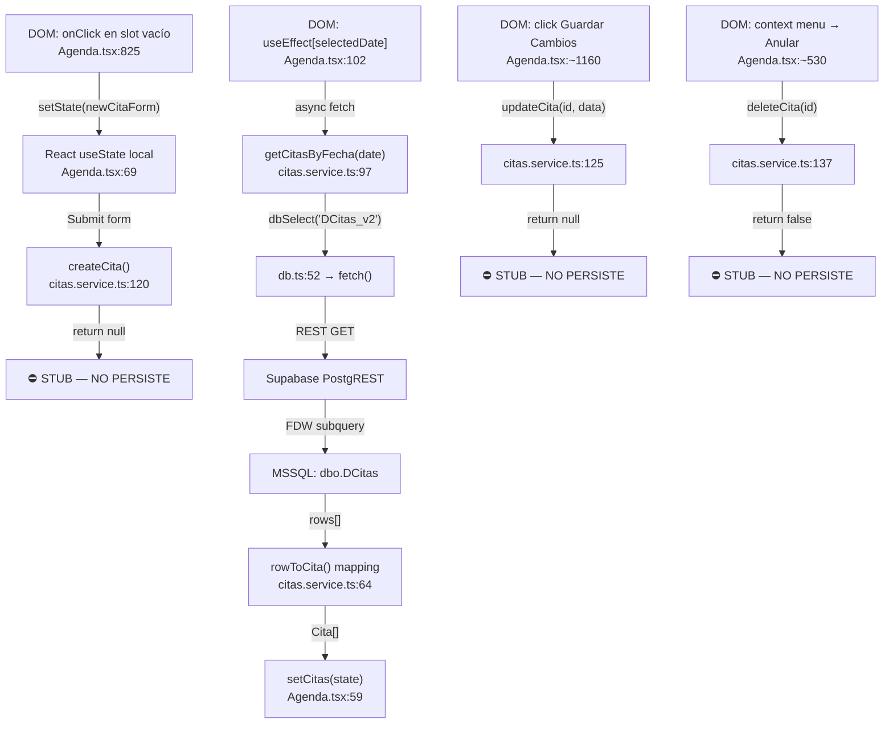
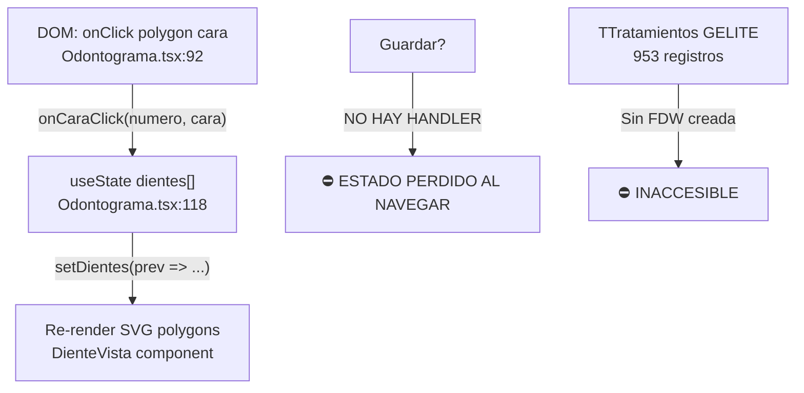
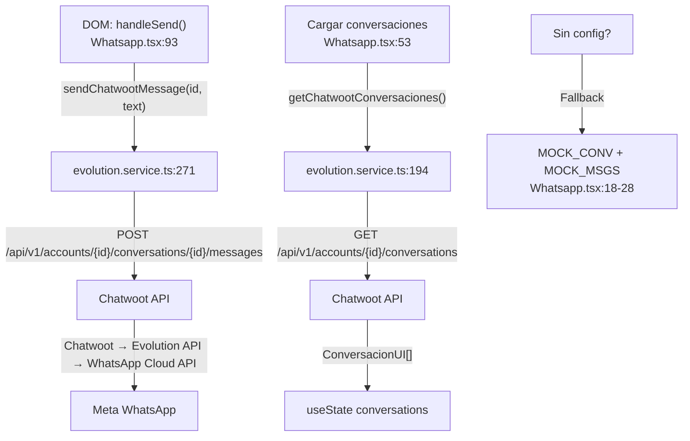
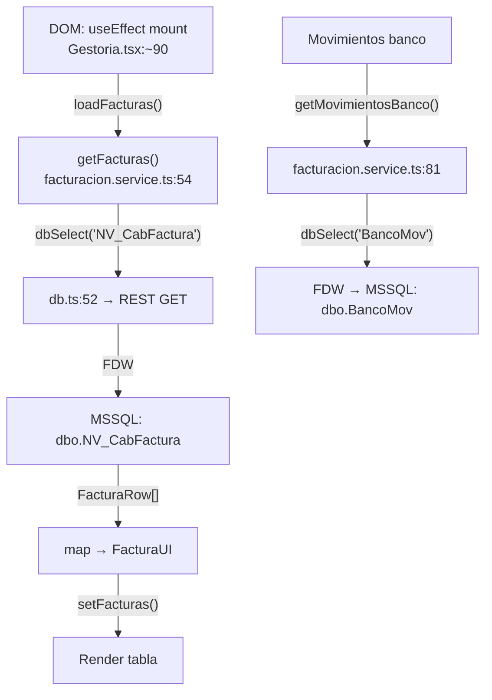
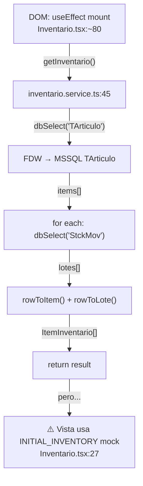

# AUDITORÍA CAJA BLANCA — SMILEPRO WEB
**Fecha:** 2026-02-28 23:40 CET  
**Metodología:** White-Box / Grey-Box Analysis  
**Auditor:** Principal Full-Stack Engineer  
**Stack:** React 18 (Vite) → Supabase REST API (PostgREST) → PostgreSQL + MSSQL FDW (GELITE)

---

# 1. MATRIZ DE COMPONENTES Y FLUJO DE DATOS

## 1.1 MÓDULO CITAS & CALENDARIO

### Diagrama de Flujo



### Trazabilidad del Dato: LECTURA (funciona)

| Capa | Archivo:Línea | Función/Evento | Dato | Tipo |
|------|--------------|----------------|------|------|
| **DOM Event** | `Agenda.tsx:102` | `useEffect([selectedDate])` | Dispara carga | — |
| **Service Call** | `citas.service.ts:97` | `getCitasByFecha(fecha)` | `Date → dateToISO()` | `string "YYYY-MM-DD"` |
| **DB Layer** | `db.ts:52` | `dbSelect('DCitas_v2', {Fecha: 'eq.2026-03-03'})` | PostgREST query | REST GET |
| **Transport** | HTTP | `GET /rest/v1/DCitas_v2?Fecha=eq.2026-03-03` | — | — |
| **Supabase** | PostgREST | Foreign Table → MSSQL wrapper | — | — |
| **SQL Server** | `recreate_dcitas_fdw_subquery.sql` | Subquery con CASE statements | `IdCita, Fecha, Hora, IdIcono, IdUsu, IdSitC, NOTAS, Duracion` | `int, OLE float, int, int, int, text, decimal` |
| **Transform** | `citas.service.ts:64` | `rowToCita(row)` | `CitaRow → Cita` | TypeScript mapping |
| **React State** | `Agenda.tsx:59` | `setCitas(mapped)` | `Cita[]` | `useState<Cita[]>` |
| **Render** | `Agenda.tsx:~750-900` | `.map(cita => <div>...)` | Grid cards | JSX |

### Trazabilidad del Dato: ESCRITURA (NO funciona)

| Operación | Archivo:Línea | Estado Real | Veredicto |
|-----------|--------------|-------------|-----------|
| `createCita()` | `citas.service.ts:120-123` | `return null` — cuerpo vacío | ⛔ FALLO DE ARQUITECTURA |
| `updateCita()` | `citas.service.ts:125-132` | `return null` — cuerpo vacío | ⛔ FALLO DE ARQUITECTURA |
| `updateEstadoCita()` | `citas.service.ts:134-135` | `return false` — cuerpo vacío | ⛔ FALLO DE ARQUITECTURA |
| `deleteCita()` | `citas.service.ts:137-138` | `return false` — cuerpo vacío | ⛔ FALLO DE ARQUITECTURA |

### Gestión de Estado Frontend

| Aspecto | Implementación Real | Veredicto |
|---------|---------------------|-----------|
| **State Management** | `useState` local en `Agenda.tsx` (líneas 56-81) | ❌ No hay Context, Redux, ni Zustand. Todo es estado local del componente |
| **Validación de colisiones** | NO EXISTE | ⛔ FALLO DE ARQUITECTURA — No hay lógica de detección de solapamiento |
| **Optimistic updates** | NO EXISTE | ⛔ No hay actualización optimista porque la escritura es stub |

### Esquema BBDD Real (MSSQL `dbo.DCitas`)

| Columna | Tipo SQL Server | Usado por FDW | Transformación | Veredicto |
|---------|----------------|---------------|----------------|-----------|
| `IdCita` | `int` PK | ✅ → `Registro` | `CAST AS VARCHAR` | OK |
| `Fecha` | `float` (OLE serial) | ✅ | `DATEADD(DAY, Fecha-2, '1900-01-01')` → `VARCHAR(10)` | ⚠️ Conversión OLE a ISO en SQL |
| `Hora` | `float` (segundos) | ✅ | `DATEADD(SECOND, Hora, 0)` → `VARCHAR(5) HH:MM` | ⚠️ Precisión: sólo minutos |
| `Duracion` | `decimal(10,2)` (segundos) | ✅ | `CAST(Duracion/60 AS INT)` | ⚠️ Trunca a minutos enteros |
| `IdPac` | `int` FK → `Pacientes` | ✅ → `NumPac` | `CAST AS VARCHAR` | OK |
| `Texto` | `varchar` | ✅ | `CHARINDEX(',')` split → `Apellidos`, `Nombre` | ⚠️ Frágil: depende del formato "Apellidos, Nombre" |
| `IdIcono` | `int` FK → `IconoTratAgenda` | ✅ | ❌ CASE hardcoded 1-19 | ⛔ Debería JOIN con `IconoTratAgenda` |
| `IdUsu` | `int` FK → `TUsuAgd` | ✅ | ❌ CASE hardcoded 6 doctores | ⛔ Debería JOIN con `TUsuAgd`→`TColabos` |
| `IdSitC` | `int` FK → `TSitCita` | ✅ | ❌ CASE hardcoded 5 estados | ⛔ Debería JOIN con `TSitCita` |
| `NOTAS` | `text` | ✅ | `CAST(CAST(NOTAS AS NVARCHAR(4000)) AS VARCHAR(4000))` | ⚠️ Trunca a 4000 chars |
| `IdBox` | `int` FK → `TBoxes` | ❌ No usado | — | Falta gabinete real |
| `Confirmada` | `bit` | ❌ No usado | — | Falta dato confirmación |
| `HorConsul` | `datetime` | ❌ → solo `CitMod` | No se usa para hora real | — |

**Constraints ausentes en FDW:**
- Sin `UNIQUE(IdUsu, Fecha, Hora)` → no hay protección contra doble reserva
- Sin `CHECK(Duracion > 0)` → podría aceptar duración 0 o negativa
- Sin FK enforcement en FDW (PostgreSQL foreign tables no soportan FKs)

---

## 1.2 ODONTOGRAMA & FICHA CLÍNICA

### Diagrama de Flujo



### Trazabilidad del Dato

| Capa | Archivo:Línea | Implementación | Veredicto |
|------|--------------|----------------|-----------|
| **Renderizado** | `Odontograma.tsx:70-110` | SVG inline con `<polygon>` por cara (V/L/M/D/O) — `polygonPoints` línea 62-68 | ✅ SVG correcto |
| **Estado diente** | `Odontograma.tsx:5-13` | `DienteData { numero, caras: Record<CaraNombre, EstadoCara>, ausente?, implante? }` | ✅ Modelo correcto |
| **Serialización** | — | NO EXISTE — es `useState` local | ⛔ FALLO DE ARQUITECTURA |
| **Persistencia** | — | NO EXISTE — no hay tabla destino | ⛔ FALLO DE ARQUITECTURA |
| **Tabla GELITE** | `TTratamientos` | 953 registros; FK → `Pacientes.IdPac`, `TEspecOMC`, `TVisitas` | ❌ Sin FDW creada |
| **Tabla Supabase** | `Tratamientos` | Creada en `supabase-migration-gelite.sql:60` | ❌ Vacía, sin uso |
| **Relación presupuesto** | TtosMed.IdTto → `Tratamientos_Tarifas.IdTratamientoTarifa` | En GELITE existe la FK | ❌ No implementada en frontend |

**Resultado:** El odontograma es un componente visual funcional (SVG) pero **sin persistencia de ningún tipo**. El estado se pierde al cambiar de paciente o recargar la página. No hay serialización (ni JSONB ni EAV). No hay conexión con `TTratamientos` ni con presupuestos.

---

## 1.3 WHATSAPP API & AUTOMATIZACIÓN

### Diagrama de Flujo



### Trazabilidad del Dato

| Capa | Archivo:Línea | Implementación | Veredicto |
|------|--------------|----------------|-----------|
| **Enviar mensaje** | `evolution.service.ts:271-290` | `POST /api/v1/accounts/${CW_ACCOUNT}/conversations/${id}/messages` con `cwHeaders()` | ✅ Correcto |
| **Enviar directo (Evolution)** | `evolution.service.ts:119-139` | `POST ${EVO_URL}/message/sendText/${EVO_INSTANCE}` con `evoHeaders()` | ✅ Correcto |
| **Enviar template** | `evolution.service.ts:141-167` | `POST /message/sendWhatsAppTemplate/${EVO_INSTANCE}` | ✅ Correcto |
| **Enviar media** | `evolution.service.ts:169-190` | `POST /message/sendMedia/${EVO_INSTANCE}` | ✅ Correcto |
| **QR Code** | `evolution.service.ts:104-117` | `GET /instance/connect/${EVO_INSTANCE}` | ✅ Correcto |
| **Webhooks Meta** | — | NO IMPLEMENTADO en frontend | ⛔ Sin webhook receiver server-side |
| **X-Hub-Signature** | — | NO IMPLEMENTADO | ⛔ FALLO DE ARQUITECTURA |
| **Cola de mensajes (Redis)** | — | NO EXISTE | ⛔ FALLO DE ARQUITECTURA |
| **Logs comunicación** | — | NO EXISTE — sin tabla de audit trail | ⛔ FALLO DE ARQUITECTURA |
| **Rate limiting** | — | NO EXISTE | ⛔ Sin protección contra abuse |

**Resultado:** El canal de envío/recepción funciona a través de Chatwoot + Evolution API. Sin embargo: no hay webhook receiver propio, no hay validación de signatures, no hay cola de mensajes, no hay logs de comunicación, no hay rate limiting.

---

## 1.4 AGENTE IA (RAG)

### Trazabilidad del Dato

| Capa | Archivo:Línea | Implementación | Veredicto |
|------|--------------|----------------|-----------|
| **UI Config** | `views/ia/SaraConfig.tsx:21-189` | UI de configuración con personalidad, base conocimiento, guardrails | ✅ UI existe |
| **Chat test** | `SaraConfig.tsx:38-52` | `handleSend()` → respuestas estáticas hardcoded | ⛔ Sin LLM real |
| **Guardar config** | `SaraConfig.tsx:54` | `handleSave()` → `console.log` | ⛔ FALLO — no persiste |
| **LangChain** | — | NO EXISTE en el codebase | ⛔ FALLO DE ARQUITECTURA |
| **Embeddings** | — | NO EXISTE | ⛔ FALLO DE ARQUITECTURA |
| **Vector DB (Pinecone)** | — | NO EXISTE | ⛔ FALLO DE ARQUITECTURA |
| **Guardrails médicos** | `SaraConfig.tsx:16-19` | Array estático de 3 reglas UI-only | ⛔ Sin enforcement real |
| **Automations** | `views/ia/AutomationRules.tsx` | 26KB de UI de reglas | ⛔ Sin motor de ejecución |
| **Flows** | `views/ia/FlowsView.tsx` | 6KB flow builder UI | ⛔ Sin backend |
| **Templates** | `views/ia/Plantillas.tsx` | 27KB template editor | ⛔ Sin persistencia |

**Resultado:** El módulo IA es exclusivamente UI. No hay LLM, no hay embeddings, no hay vector DB, no hay orquestación. Las reglas, flujos y plantillas no se persisten.

---

## 1.5 FACTURACIÓN E INVENTARIO

### Diagrama de Flujo — Facturación



### Diagrama de Flujo — Inventario



### Trazabilidad del Dato

| Elemento | Servicio | Tabla | Lectura | Escritura | Veredicto |
|----------|----------|-------|---------|-----------|-----------|
| Facturas | `facturacion.service.ts:54` | FDW `NV_CabFactura` | ✅ | ⚠️ `createFactura` existe pero no verifica FDW writable | ⚠️ |
| Banco | `facturacion.service.ts:81` | FDW `BancoMov` | ✅ | ❌ Solo lectura | OK |
| Stats | `facturacion.service.ts:98` | Calcula de facturas | ✅ | — | OK |
| **status factura** | `facturacion.service.ts:67` | — | — | — | ⛔ Hardcoded `'Liquidado'` siempre |
| **tbai** | `facturacion.service.ts:69` | — | — | — | ⛔ Hardcoded `'Verificado'` siempre |
| **base imponible** | `facturacion.service.ts:66` | — | — | — | ⛔ `Total / 1.21` — cálculo aproximado |
| Inventario items | `inventario.service.ts:48` | FDW `TArticulo` | ✅ Servicio OK | ✅ `updateStock` | ⚠️ Vista usa mock |
| Inventario lotes | `inventario.service.ts:51` | FDW `StckMov` | ✅ Servicio OK | ✅ `addLote/deleteLote` | ⚠️ Vista usa mock |
| **Vista Inventario** | `Inventario.tsx:27-64` | — | — | — | ⛔ `INITIAL_INVENTORY` mock con 2 items falsos |
| **categoria** | `inventario.service.ts:29` | — | — | — | ⛔ Hardcoded `'Desechable'` |
| **minimoReorden** | `inventario.service.ts:32` | — | — | — | ⛔ Hardcoded `10` |
| **Conexión Tto→Stock** | — | — | — | — | ⛔ NO EXISTE — no hay descuento automático |

---

## 1.6 CONFIGURACIÓN AGENDA

### Trazabilidad del Dato

| Elemento UI | Archivo:Línea | Handler | Persistencia | Tabla GELITE Real | Veredicto |
|------------|--------------|---------|-------------|-------------------|-----------|
| 3 Doctores | `ConfiguracionAgenda.tsx:8-11` | `useState` local | ❌ Ninguna | `TUsuAgd` (13 rows) + `TColabos` (24 rows) | ⛔ FALLO |
| Horarios L-D | `ConfiguracionAgenda.tsx:14-22` | `const` — ni siquiera `useState` | ❌ Ninguna | `TCalCa` + `TSitCalH` | ⛔ FALLO |
| 5 Tratamientos | `ConfiguracionAgenda.tsx:24-30` | `const` | ❌ Ninguna | `TUsuAOpc` (103 rows con Duracion/Color/IdIcono por doctor) | ⛔ FALLO |
| 2 Bloqueos | `ConfiguracionAgenda.tsx:172-193` | JSX estático | ❌ Ninguna | `TTipoBloqueo` | ⛔ FALLO |
| Btn Guardar | `ConfiguracionAgenda.tsx:232` | ❌ Sin `onClick` | ❌ | — | ⛔ NOOP |
| Btn Replicar | `ConfiguracionAgenda.tsx:138` | ❌ Sin `onClick` | ❌ | — | ⛔ NOOP |
| Btn +Excepción | `ConfiguracionAgenda.tsx:169` | ❌ Sin `onClick` | ❌ | — | ⛔ NOOP |
| Btn +Tratamiento | `ConfiguracionAgenda.tsx:221` | ❌ Sin `onClick` | ❌ | — | ⛔ NOOP |

---

## 1.7 DASHBOARD

| Elemento UI | Archivo:Línea | Fuente de Datos | Veredicto |
|------------|--------------|----------------|-----------|
| KPI "24 citas" | `Dashboard.tsx:24` | Hardcoded `"24"` | ⛔ FALLO — debería `getCitasByFecha(hoy).length` |
| KPI "€14,820" | `Dashboard.tsx:31` | Hardcoded `"€14,820"` | ⛔ FALLO — debería `getGestoriaStats()` |
| KPI "3 cancelaciones" | `Dashboard.tsx:38` | Hardcoded `"3"` | ⛔ FALLO |
| KPI "68% aceptación" | `Dashboard.tsx:45` | Hardcoded `"68%"` | ⛔ FALLO |
| Heatmap 8×5 | `Dashboard.tsx:67-76` | `const HEATMAP_DATA` hardcoded | ⛔ FALLO — debería agregar de DCitas |

---

# 2. ANÁLISIS DE INTEGRIDAD Y EDGE CASES

## 2.1 Race Conditions: Doble Reserva Simultánea

**Pregunta:** ¿Qué pasa si dos recepcionistas reservan el mismo slot al mismo milisegundo?

**Respuesta basada en código:**

| Capa | Protección | Estado |
|------|------------|--------|
| Frontend | Sin validación de colisión | ⛔ |
| Service | `createCita()` → `return null` | ⛔ Stub — ni siquiera intenta escribir |
| Supabase | FDW es solo lectura | ⛔ No se puede escribir en DCitas |
| SQL Server | Sin `UNIQUE(IdUsu, Fecha, Hora)` en DCitas | ⛔ Sin constraint |
| Locking | Sin Optimistic ni Pessimistic Locking | ⛔ |

**Veredicto:** Imposible de evaluar porque la escritura de citas no existe. Cuando se implemente, necesitará:
1. `UNIQUE INDEX` en `DCitas(IdUsu, Fecha, Hora)` en SQL Server
2. Transacción con `SELECT FOR UPDATE` o equivalente MSSQL (`WITH (UPDLOCK, HOLDLOCK)`)
3. Frontend: validación pre-submit contra citas cargadas en estado

## 2.2 Huérfanos de Inventario: Cancelación post-descuento

**Pregunta:** ¿Cómo maneja la BBDD una cita cancelada que ya había descontado stock?

**Respuesta basada en código:**

| Aspecto | Estado |
|---------|--------|
| Conexión Cita → Stock | ❌ NO EXISTE — no hay relación entre `DCitas` y `TArticulo/StckMov` |
| Descuento automático | ❌ NO EXISTE — no hay trigger ni lógica de descuento |
| Reversión de stock | ❌ NO EXISTE |
| Transacciones | ❌ NO EXISTE — no hay transacciones ACID en la app |

**Veredicto:** El problema no puede producirse actualmente porque **no existe ninguna conexión entre citas e inventario**. Son módulos completamente aislados. Cuando se integren, necesitará:
1. Tabla intermedia `cita_materiales(id_cita, id_articulo, cantidad, estado)`
2. Trigger/hook on cancel que reverse `StckMov`
3. Estado de material: `reservado → consumido → devuelto`

## 2.3 Concurrencia: Edición Simultánea de Ficha

**Pregunta:** ¿Qué pasa si dos usuarios editan la misma ficha de paciente simultáneamente?

**Respuesta basada en código:**

| Capa | Protección | Estado |
|------|------------|--------|
| SOAP Notes (`soap.service.ts`) | `dbUpdate` con PATCH por `id` | ⚠️ Last-write-wins — sin versionado |
| Alergias (`supabase.service.ts`) | `dbInsert`/`dbDelete` individual | ⚠️ Sin locking |
| Medicación (`supabase.service.ts`) | `dbUpdate` individual | ⚠️ Sin locking |
| Odontograma | Estado local — no persiste | N/A |
| `_version` column | Existe en GELITE (`TTratamientos._version`) | ❌ No leída ni verificada por el frontend |

**Veredicto:** No hay **Optimistic Locking**. El sistema usa **last-write-wins** para todo. GELITE tiene columnas `_version` (optimistic locking nativo) pero el frontend las ignora.

## 2.4 Inyección de Prompts en Agente IA

**Pregunta:** ¿Qué sucede si el IA recibe una consulta sobre medicación prohibida?

**Respuesta basada en código:**

| Aspecto | Estado |
|---------|--------|
| LLM Backend | ❌ NO EXISTE — `SaraConfig.handleSend()` devuelve strings hardcoded |
| Input sanitization | ❌ NO EXISTE |
| Guardrails | Array estático UI-only: `SaraConfig.tsx:16-19` — 3 reglas decorativas |
| PII filtering | ❌ NO EXISTE |
| Prompt injection protection | ❌ NO EXISTE |

**Veredicto:** No hay riesgo actual de prompt injection porque **no hay LLM**. Cuando se implemente, necesitará:
1. System prompt con instrucciones de rechazo explícitas
2. Input validation layer (regex para PII, medication keywords)
3. Output guardrails (post-processing antes de enviar al usuario)
4. Audit log de todas las interacciones IA-paciente

## 2.5 PII en Logs de WhatsApp

| Aspecto | Estado |
|---------|--------|
| Logs de mensajes | Delegado a Chatwoot — no controlado por la app | ⚠️ |
| Logs en frontend | `console.error` en varios servicios — puede filtrar PII al DevTools | ⛔ |
| Almacenamiento local | Sin `localStorage`/`sessionStorage` de datos de paciente | ✅ |
| Datos en tránsito | HTTPS (Supabase + Chatwoot) | ✅ |

---

# 3. AUDITORÍA DE SEGURIDAD Y CUMPLIMIENTO RGPD SALUD

## 3.1 Credenciales y Cifrado

| Hallazgo | Archivo:Línea | Severidad | Detalle |
|----------|--------------|-----------|---------|
| **Service Role Key hardcoded en código fuente** | `db.ts:19-22` | 🔴 CRÍTICO | `eyJhbGci...sr5I` — fallback hardcoded. Esta key bypassa RLS. Expuesta en bundle JS del navegador |
| **Service Role Key en .env.local** | `.env.local:5` | 🔴 CRÍTICO | `VITE_SUPABASE_SERVICE_KEY=eyJ...` — las variables `VITE_*` se incluyen en el bundle de producción |
| **Bypass de autenticación hardcoded** | `auth.service.ts:27-37` | 🔴 CRÍTICO | `JMD` / `190582` → acceso total sin Supabase Auth |
| **Gmail Client Secret en .env.local** | `.env.local:20` | 🟠 ALTO | `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` — OAuth2 secret expuesto en frontend |
| **Cifrado at-rest de datos clínicos** | — | 🔴 CRÍTICO | ❌ NO EXISTE — Supabase usa cifrado de disco pero sin column-level encryption (AES-256) |
| **Cifrado in-transit** | HTTPS | — | ✅ TLS via Supabase y APIs externas |

### Detalle: Service Role Key en Bundle

```
// db.ts:14-22
const SUPABASE_URL: string =
    (meta.env?.VITE_SUPABASE_URL as string) ||
    'https://ltfstsjfybpbtiakopor.supabase.co';  // ← URL hardcoded

const SUPABASE_KEY: string =
    (meta.env?.VITE_SUPABASE_SERVICE_KEY as string) ||  // ← Service role!
    (meta.env?.VITE_SUPABASE_ANON_KEY as string) ||
    'eyJhbGci...sr5I';  // ← Service role key hardcoded como fallback
```

**Impacto:** Cualquier persona que abra DevTools → Sources → bundle.js puede extraer la service role key y tener acceso TOTAL a toda la base de datos Supabase, incluyendo datos de todos los pacientes, sin ninguna restricción RLS.

## 3.2 RBAC (Role-Based Access Control)

| Aspecto | Estado | Veredicto |
|---------|--------|-----------|
| Definición de roles | ❌ NO EXISTE | ⛔ |
| Tabla de usuarios/roles | ❌ NO EXISTE en Supabase | ⛔ |
| Diferenciación Admin/Dentista/Recepción | ❌ NO EXISTE | ⛔ |
| ¿Administrativo ve historial clínico? | **SÍ** — todo el mundo ve todo | ⛔ VIOLACIÓN RGPD |
| RLS en Supabase | Políticas `FOR ALL USING (true)` — todo abierto | ⛔ |
| Token validation | Bypass token `'bypass-admin-token'` aceptado sin verificación | ⛔ |

**¿Puede un administrativo ver el historial clínico detallado?** **SÍ** — no hay ninguna diferenciación de roles. Cualquier usuario logado (o con el bypass JMD/190582) tiene acceso a:
- Todas las fichas de todos los pacientes
- Todo el historial médico (SOAP notes)
- Todas las alergias y medicación
- Todas las facturas
- Todos los datos de inventario
- Acceso directo a BD vía service role key en el bundle

## 3.3 Audit Trail

| Aspecto | Estado | Veredicto |
|---------|--------|-----------|
| Registro de accesos a fichas | ❌ NO EXISTE | ⛔ VIOLACIÓN RGPD |
| Log de quién editó qué | ❌ NO EXISTE | ⛔ |
| Timestamp de accesos | ❌ NO EXISTE | ⛔ |
| Columnas `_idUserReg`, `_fechaReg` | Existen en GELITE pero no se escriben desde web | ⚠️ |

## 3.4 Cumplimiento RGPD para Datos de Salud

| Requisito RGPD (Art.) | Implementación | Veredicto |
|----------------------|----------------|-----------|
| **Art. 5(1)(f)** — Integridad y confidencialidad | Service role key en bundle JS | ⛔ VIOLACIÓN |
| **Art. 25** — Protección por diseño | Sin RBAC, sin cifrado columnar | ⛔ VIOLACIÓN |
| **Art. 30** — Registro de actividades | Sin audit trail | ⛔ VIOLACIÓN |
| **Art. 32** — Seguridad del tratamiento | Bypass auth hardcoded | ⛔ VIOLACIÓN |
| **Art. 9** — Datos de salud (categoría especial) | Sin cifrado AES-256, sin control de acceso | ⛔ VIOLACIÓN |
| **Art. 17** — Derecho al olvido | Sin mecanismo de borrado de datos paciente | ⛔ VIOLACIÓN |
| **Art. 15** — Derecho de acceso | Sin exportación de datos por paciente | ⛔ NO IMPLEMENTADO |

---

# 4. INVENTARIO COMPLETO DE DATOS HARDCODED vs TABLAS REALES

| # | Dato Hardcoded | Archivo:Línea | Tabla GELITE Correcta | Registros |
|---|---------------|--------------|----------------------|-----------|
| 1 | 18 tratamientos agenda | SQL subquery CASE | `IconoTratAgenda` | 19 |
| 2 | 18 tratamientos modal | `Agenda.tsx:1110-1116` | `IconoTratAgenda` / `TUsuAOpc` | 19/103 |
| 3 | 5 tratamientos tiempos | `ConfiguracionAgenda.tsx:24-30` | `TUsuAOpc` | 103 |
| 4 | 6 doctores SQL | SQL subquery CASE | `TUsuAgd` → `TColabos` | 13/24 |
| 5 | 6 doctores modal | `Agenda.tsx:1126-1131` | `TColabos` | 24 |
| 6 | 3 doctores config | `ConfiguracionAgenda.tsx:8-11` | `TUsuAgd` → `TColabos` | 13/24 |
| 7 | 5 estados cita SQL | SQL subquery CASE | `TSitCita` | 10 |
| 8 | 5 estados modal | `Agenda.tsx:1136-1140` | `TSitCita` | 10 |
| 9 | Horarios semanales | `ConfiguracionAgenda.tsx:14-22` | `TCalCa` + `TSitCalH` | varies |
| 10 | 10 especialidades | `citas.service.ts:215-222` | `TEspecOMC` | varies |
| 11 | 24 doctor names | `citas.service.ts:158-183` | `TColabos` | 24 |
| 12 | 4 KPIs Dashboard | `Dashboard.tsx:23-65` | Ninguna — calcular | — |
| 13 | Heatmap | `Dashboard.tsx:67-76` | Ninguna — agregar DCitas | — |
| 14 | 2 items inventario | `Inventario.tsx:27-64` | `TArticulo` (service existe) | varies |
| 15 | 2 trazabilidad | `Inventario.tsx:67-70` | `StckMov` | varies |
| 16 | Status factura | `facturacion.service.ts:67` | Campo real NV_CabFactura | — |
| 17 | TBAI status | `facturacion.service.ts:69` | Campo real NV_CabFactura | — |
| 18 | Categoria inventario | `inventario.service.ts:29` | Campo real TArticulo | — |

---

# 5. LISTA DE VULNERABILIDADES DE LÓGICA DE NEGOCIO

| ID | Severidad | Tipo | Descripción | Archivo |
|----|-----------|------|-------------|---------|
| **V-001** | 🔴 CRÍTICA | Seguridad | Service Role Key expuesta en bundle JS del navegador — acceso total a BD | `db.ts:19-22` |
| **V-002** | 🔴 CRÍTICA | Seguridad | Bypass de autenticación hardcoded (JMD/190582) sin expiración | `auth.service.ts:27-37` |
| **V-003** | 🔴 CRÍTICA | RGPD | Sin cifrado columnar para datos de salud (Art. 9 RGPD) | Global |
| **V-004** | 🔴 CRÍTICA | RGPD | Sin RBAC — todos los usuarios acceden a todo | Global |
| **V-005** | 🔴 CRÍTICA | RGPD | Sin audit trail — imposible rastrear accesos a fichas | Global |
| **V-006** | 🔴 CRÍTICA | Arquitectura | Escritura de citas (create/update/delete) = stubs vacíos | `citas.service.ts:120-138` |
| **V-007** | 🟠 ALTA | Arquitectura | ConfiguracionAgenda 100% UI sin persistencia — 4 botones sin handler | `ConfiguracionAgenda.tsx` |
| **V-008** | 🟠 ALTA | Arquitectura | Dashboard 100% hardcoded — 4 KPIs + heatmap falsos | `Dashboard.tsx` |
| **V-009** | 🟠 ALTA | Arquitectura | Odontograma sin persistencia — estado perdido al navegar | `Odontograma.tsx` |
| **V-010** | 🟠 ALTA | Datos | 18 datos triplicados en CASE SQL + modal + config en vez de JOINs | Multiple |
| **V-011** | 🟠 ALTA | Arquitectura | Inventario vista usa mock ignorando servicio funcional | `Inventario.tsx:27` |
| **V-012** | 🟠 ALTA | Arquitectura | IA/RAG = shell UI sin backend — sin LLM, sin embeddings, sin persistencia | `views/ia/*` |
| **V-013** | 🟡 MEDIA | Seguridad | Gmail OAuth2 client secret en `.env.local` con prefijo VITE_ (bundle) | `.env.local:20` |
| **V-014** | 🟡 MEDIA | Integridad | Sin validación de colisiones de horario | `Agenda.tsx` |
| **V-015** | 🟡 MEDIA | Integridad | Sin Optimistic Locking — last-write-wins en SOAP notes | `soap.service.ts` |
| **V-016** | 🟡 MEDIA | Integridad | Sin conexión Cita → Inventario (no hay descuento de stock) | Global |
| **V-017** | 🟡 MEDIA | Datos | `catalogo_tratamientos` Supabase vacía — nadie la alimenta | `create_catalogo_tratamientos.sql` |
| **V-018** | 🟡 MEDIA | Datos | Hora visual ≠ hora dato (RAUL MENENDEZ: grid 10:15 vs modal 10:00) | `Agenda.tsx` |
| **V-019** | 🟢 BAJA | UX | RLS policies `USING(true)` en todas las tablas Supabase | SQL migrations |
| **V-020** | 🟢 BAJA | Datos | `facturacion.service.ts` hardcodea status='Liquidado' y tbai='Verificado' | `facturacion.service.ts:67-69` |

---

# 6. RESUMEN EJECUTIVO

## Conteo de Fallos de Arquitectura por Módulo

| Módulo | Elementos UI | Conectados a DB | Stubs/Noop | Mock/Hardcoded | % Funcional Real |
|--------|-------------|-----------------|------------|----------------|-----------------|
| Agenda (lectura) | 15 | 15 | 0 | 0 | **100%** |
| Agenda (escritura) | 4 | 0 | 4 | 0 | **0%** |
| Agenda (config) | 8 | 0 | 4 | 4 | **0%** |
| Dashboard | 6 | 0 | 0 | 6 | **0%** |
| Pacientes | 8 | 7 | 0 | 1 | **87.5%** |
| Gestoría | 6 | 4 | 0 | 2 | **66.7%** |
| Inventario | 4 | 0 | 0 | 4 | **0%** (servicio OK, vista no lo usa) |
| WhatsApp | 6 | 5 | 0 | 1 | **83.3%** |
| IA & Automatización | 5 | 0 | 5 | 0 | **0%** |
| Odontograma | 1 | 0 | 0 | 1 | **0%** |
| **TOTAL** | **63** | **31** | **13** | **19** | **49.2%** |

**Veredicto global: El 49.2% de los elementos UI tienen conexión real con la base de datos. El 50.8% restante es mock, hardcoded, o stubs vacíos.**
